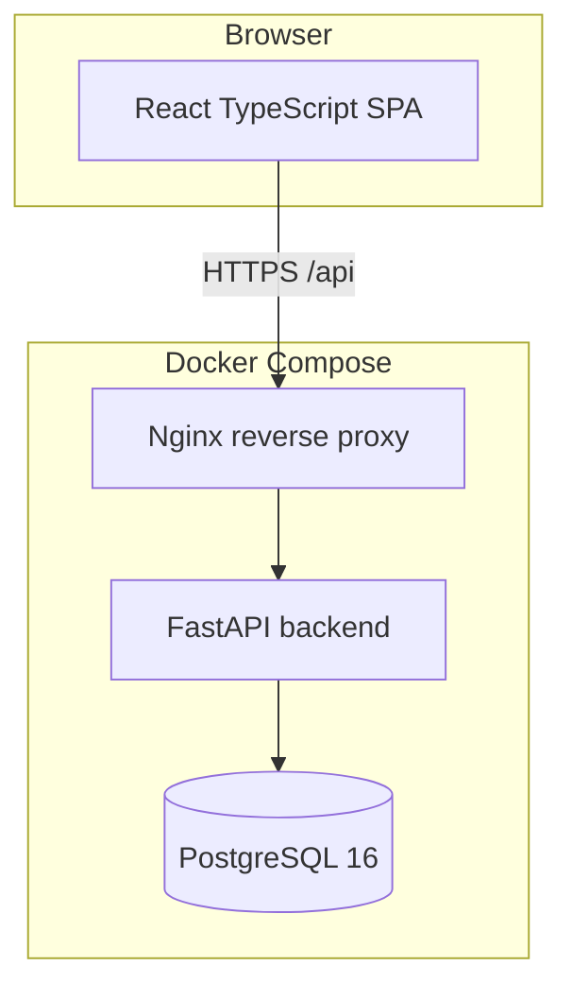
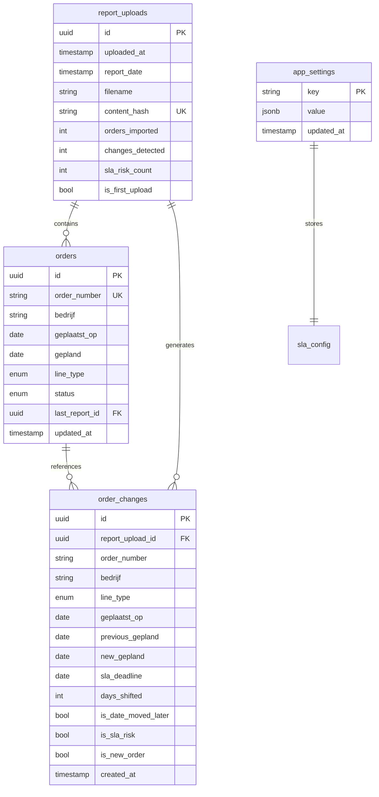

# Technical Design — BSP Infrastructure Plan Tool

## 1. Solution architecture



| Component | Technology | Rationale |
|-----------|------------|-----------|
| Backend | FastAPI + Python 3.12 | Async-capable, OpenAPI, strong typing |
| ORM | SQLAlchemy 2.x + Alembic | Mature PostgreSQL support, migrations |
| Frontend | React 18 + TypeScript + Vite | Rich dashboard UX, chosen in requirements |
| UI | Tailwind CSS + shadcn-style components | Enterprise look, dark mode support |
| Database | PostgreSQL 16 | Required; JSONB for optional metadata |
| Proxy | Nginx | Static frontend + API routing in production compose |

### Frontend choice justification

**React + TypeScript** selected over HTMX + Jinja2 because the FD requires expandable KPI cards, filters, drill-down customer cards, change history tables, and dark mode — all benefit from a component-based SPA with client-side filtering without full page reloads.

### Authentication (v1)

No auth in v1. API designed with optional `AUTH_ENABLED` env flag for future Azure AD integration via `fastapi-azure-auth` or similar.

---

## 2. Database design (ERD)



### Line type enum

`onnet`, `offnet`, `special` — mapped from XML `On-/Offnet` values.

### Order status enum

`open`, `completed` — completed when order disappears from report.

---

## 3. SLA business-day algorithm

- **Start:** `Geplaatst op` date (Europe/Amsterdam)
- **Deadline:** Add N **business days** using Netherlands public holidays (`holidays` library, country `NL`)
- **Convention:** Start day is day 0; count N business days forward; deadline is end of that Nth business day
- **SLA risk:** `new_gepland.date() > sla_deadline.date()`

---

## 4. API design

Base path: `/api/v1`

| Method | Path | Description |
|--------|------|-------------|
| POST | `/reports/upload` | Upload Excel-XML file (multipart) |
| GET | `/reports/latest` | Latest upload metadata |
| GET | `/dashboard` | Customer cards for latest comparison |
| GET | `/dashboard/kpi` | SLA risk count from latest upload |
| GET | `/changes` | Paginated change history with filters |
| GET | `/changes/export` | CSV export |
| GET | `/orders` | List open orders (optional filters) |
| GET | `/settings` | All app settings |
| PUT | `/settings/sla` | Update SLA days per line type |
| PUT | `/settings/retention` | Update retention days |

### Query parameters — `/changes`

- `bedrijf`, `line_type`, `is_sla_risk`, `date_from`, `date_to`, `search`, `page`, `page_size`

### Dashboard response shape

```json
{
  "last_upload": { "uploaded_at": "...", "report_date": "...", "changes_detected": 5 },
  "customers": [
    {
      "bedrijf": "Dummy Bedrijf 001",
      "has_change": true,
      "has_sla_risk": true,
      "order_count": 2,
      "orders": [...]
    }
  ]
}
```

---

## 5. XML parsing service

- Parse with `xml.etree.ElementTree`
- Namespaces: `ss` = `urn:schemas-microsoft-com:office:spreadsheet`
- Locate worksheet `Lijn orders` by `ss:Name` attribute
- Row 1: header cells → column index map
- Rows 2+: data; handle `ss:Index` gaps on cells
- DateTime cells: `ss:Type="DateTime"` ISO format
- Info sheet: scan rows for label `Aangemaakt op` → adjacent value
- Required columns: `Order number`, `Bedrijf`, `Geplaatst op`, `Gepland`, `On-/Offnet`

### Duplicate detection

SHA-256 hash of raw file bytes; reject if hash exists in `report_uploads.content_hash`.

---

## 6. Change detection service

1. Load previous open orders keyed by `order_number`
2. For each parsed order:
   - If first upload → create `order_changes` with `is_new_order=true`
   - Else if new order_number → upsert order, no change record (per FD)
   - Else if `gepland` > previous `gepland` → change record with `is_date_moved_later=true`
   - Compute SLA deadline; set `is_sla_risk` if new gepland > deadline
3. Orders in DB but not in file → status `completed`, no change record

---

## 7. Security architecture (v1)

| Layer | Measure |
|-------|---------|
| Network | Deploy on trusted internal network only |
| API | No auth v1; CORS restricted to frontend origin |
| Upload | Max file size 50 MB; content-type validation |
| SQL | Parameterized queries via SQLAlchemy |
| Future | Azure AD OAuth2 bearer tokens, RBAC middleware |

---

## 8. Docker architecture

```yaml
services:
  db:       postgres:16-alpine, volume pgdata
  backend:  builds from backend/Dockerfile, depends on db
  frontend: builds from frontend/Dockerfile (nginx serves static)
  nginx:    optional combined routing (or frontend container proxies /api)
```

Environment variables:

- `DATABASE_URL=postgresql+asyncpg://...`
- `CORS_ORIGINS=http://localhost:5173`
- `RETENTION_DAYS=365`
- `LOG_LEVEL=INFO`

---

## 9. Deployment architecture

- On-premises Linux host with Docker Engine + Compose v2
- Single-node, no HA (per FD)
- Logs: stdout JSON structured logging
- Migrations: Alembic on backend startup
- Retention job: APScheduler daily cleanup of `order_changes` older than configured retention

---

## 10. Monitoring and logging

- Python `logging` with structured format: timestamp, level, message, request_id
- Upload events logged with filename, counts, duration
- Error tracking: log exceptions with stack traces; Sentry hook optional via env
